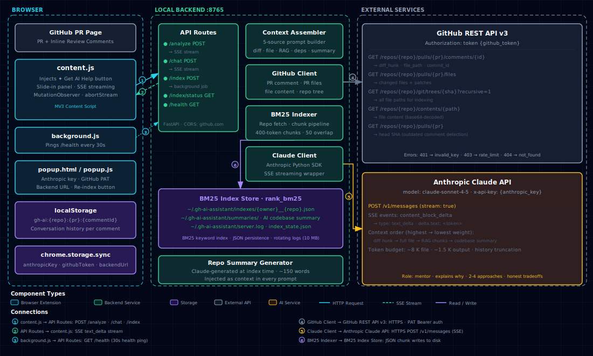

# PR Review AI Assistant

A Chrome extension + local backend that injects an AI help button next to GitHub PR review comments. Click it to get an instant analysis of what the reviewer means, multiple ways to address the feedback, and honest tradeoffs — all grounded in the actual code.

**Goal:** Help PR authors *understand* reviewer feedback, not auto-fix it.

---

## Architecture

[](architecture-diagram.html)

> Click the diagram to open the full interactive version.

---

## How it works

```
GitHub PR page (browser)
  │
  ├── [✦ Get AI Help] button injected next to each review comment
  │
  └── Click → dark panel slides in
        │
        ├── Backend fetches: diff hunk · full file · related PR changes · import deps
        ├── BM25 RAG retrieves relevant codebase chunks
        ├── AI-generated codebase summary (produced at index time)
        │
        └── Claude streams back:
              • What the reviewer means (plain English)
              • 2–4 ways to address it, each with pros/cons
              • Which approach fits this codebase
              └── Follow-up chat (with full code context pinned)
```

```
┌─────────────────────────────────────────┐
│  github.com (Chrome)                    │
│  ┌─────────────────────────────────┐    │
│  │  Review comment    [✦ Get AI]  │    │
│  └─────────────────────────────────┘    │
│              │ SSE stream               │
└──────────────┼──────────────────────────┘
               │ HTTP localhost:8765
┌──────────────┼──────────────────────────┐
│  Local backend (FastAPI)                │
│  /analyze  /chat  /index  /health       │
│       │                │                │
│  Context assembler    Indexer           │
│       │                │                │
│  Claude API      BM25 + JSON store      │
└─────────────────────────────────────────┘
```

---

## Prerequisites

- **Python 3.8+**
- **Google Chrome**
- **Anthropic API key** — [console.anthropic.com](https://console.anthropic.com)
- **GitHub Personal Access Token** with `repo` scope — Settings → Developer settings → Personal access tokens

---

## Setup

### 1 — Start the backend

```bash
cd backend
bash start.sh
```

`start.sh` creates a virtual environment, installs all dependencies, and starts the server at `http://127.0.0.1:8765`. Leave this terminal running.

Verify it's healthy:
```bash
curl http://127.0.0.1:8765/health
# {"status":"ok","version":"0.1.0"}
```

### 2 — Load the Chrome extension

1. Open `chrome://extensions`
2. Enable **Developer mode** (top-right toggle)
3. Click **Load unpacked** → select the `extension/` folder
4. The ✦ icon appears in your toolbar

### 3 — Add your API keys

1. Click the ✦ extension icon → settings popup opens
2. Enter your **Anthropic API key** (`sk-ant-...`)
3. Enter your **GitHub Personal Access Token** (`ghp_...`)
4. Click **Save Settings**
5. The footer should show **✓ Backend running**

---

## Usage

1. Navigate to a GitHub PR where **you are the author**
2. Find any inline review comment — a **✦ Get AI Help** button appears next to it
3. Click it — the panel slides in from the right
4. **First use on a repo:** the backend indexes the repository (BM25 + AI summary). This takes 1–3 minutes depending on repo size. Progress is shown in the panel.
5. The AI streams its analysis: what the reviewer means, 2–4 approaches, pros/cons
6. Ask follow-up questions in the input bar at the bottom
7. Close the panel — conversation is saved. Reopen the same comment to continue where you left off.

### Panel controls

| Control | Action |
|---|---|
| **⟳** (header) | Clear current conversation and re-analyze |
| **×** (header) | Close panel (conversation saved to localStorage) |
| **Start fresh analysis** | Wipe saved history and trigger a new analysis |

### Popup controls

| Control | Action |
|---|---|
| **Save Settings** | Persist API keys to Chrome sync storage |
| **Re-index [repo]** | Force re-index the current PR's repo (picks up new files) |

---

## Storage

| Location | What's stored |
|---|---|
| `~/.gh-ai-assistant/indexes/` | BM25 chunk index per repo (`owner__repo.json`) |
| `~/.gh-ai-assistant/summaries/` | AI-generated codebase summary per repo |
| `~/.gh-ai-assistant/index_state.json` | Indexing status per repo |
| `~/.gh-ai-assistant/server.log` | Server logs (rotated at 10 MB, 2 backups) |
| Browser `localStorage` | Conversation history per comment (`gh-ai:{repo}:{pr}:{commentId}`) |
| `chrome.storage.sync` | API keys and backend URL |

To reset everything:
```bash
rm -rf ~/.gh-ai-assistant/
```

To clear all saved conversations (run in browser console on any GitHub page):
```js
Object.keys(localStorage).filter(k => k.startsWith("gh-ai:")).forEach(k => localStorage.removeItem(k));
```

---

## Architecture

| Component | Tech |
|---|---|
| Browser extension | Chrome MV3, vanilla JS |
| Backend | Python 3.8+, FastAPI, Uvicorn |
| AI model | `claude-sonnet-4-5` (Anthropic) |
| Retrieval | BM25 (`rank_bm25`), keyword-based |
| Streaming | Server-Sent Events (SSE) |
| Conversation storage | Browser `localStorage` |
| GitHub auth | Personal Access Token (PAT) |

---

## Project structure

```
github-suggest-fix/
├── extension/          # Chrome MV3 extension
│   ├── manifest.json
│   ├── content.js      # Button injection, panel UI, streaming
│   ├── content.css     # Option B dark-purple styles
│   ├── background.js   # Backend health ping, message relay
│   ├── popup.html/js/css  # Settings page
│   └── icons/
│
└── backend/            # Local FastAPI server
    ├── main.py         # App entry point + logging
    ├── start.sh        # One-command startup
    ├── config.py       # Ports, paths, token budgets
    ├── routes/
    │   ├── analyze.py  # POST /analyze, POST /chat
    │   ├── index.py    # POST /index, GET /index/status
    │   └── health.py   # GET /health
    └── services/
        ├── context_assembler.py  # Prompt construction
        ├── github_client.py      # GitHub REST API wrapper
        ├── indexer.py            # Repo fetch + chunk pipeline
        ├── vector_store.py       # BM25 index (persist + query)
        ├── repo_summary.py       # AI codebase summary
        └── claude_client.py      # Anthropic streaming wrapper
```
